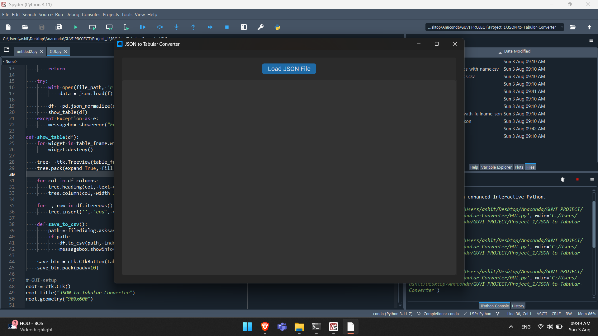
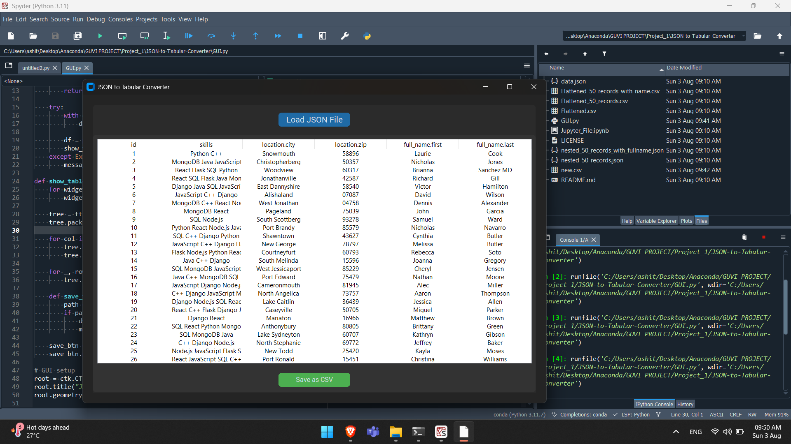
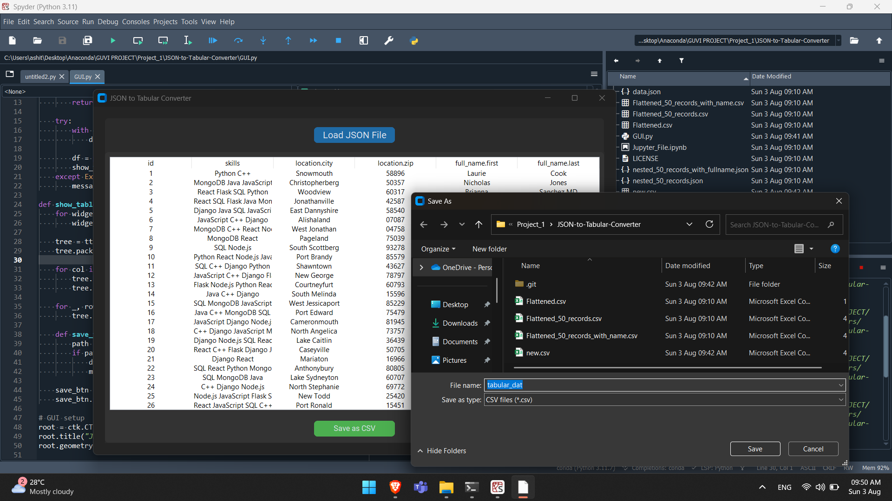

# JSON-to-Tabular-Converter 🛠️

Convert complex nested JSON files into clean, analysis-ready CSV tables using Python.

---

## 🚀 Project Overview

This repository demonstrates the full workflow of reshaping irregular JSON data into a structured tabular format:

- 📓 **Jupyter Notebook demo** — core logic using `pandas`.
- 🖼️ **Tkinter + customtkinter GUI** — upload any JSON → view table → export CSV (no coding needed).

---

## 🔧 Features

- Supports nested JSON (e.g., `full_name.first → First Name`)
- One-click CSV export
- Built with `pandas`, `numpy`, `matplotlib`, `tkinter`, `customtkinter`
- Designed for quick data analytics use in Excel/Power BI/Tableau

---

## 📂 Repository Structure

| File / Folder              | Description                               |
|---------------------------|-------------------------------------------|
| `JSON_to_CSV.ipynb`       | Notebook walk-through                      |
| `gui_converter.py`        | GUI application                            |
| `assets/step*.png`        | GUI screenshots (1-4)                      |
| `sample_json/`            | Test JSON files                            |
| `README.md`               | Project documentation                      |
| `Documentaion.pptx`       | Presentaion File                           |
---

## 💻 GUI Demo

| Step | Action                               | Screenshot                  |
|------|--------------------------------------|-----------------------------|
| 1    | Launch application                   |        |
| 2    | Select & load JSON file              |        |
| 3    | View flattened data in table         |        |
| 4    | Export to CSV                        |        |

---

## ▶️ Run GUI

```bash
pip install pandas numpy matplotlib customtkinter
python gui_converter.py
